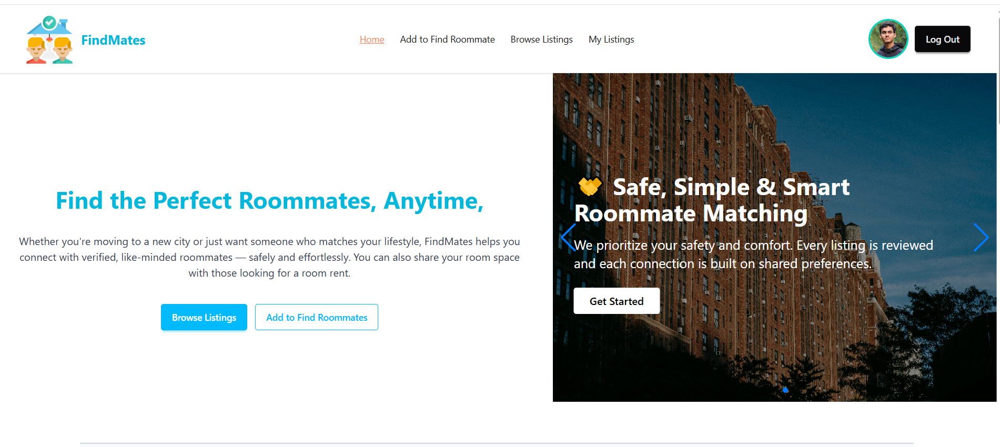

# FindMates - Roommate Finding Platform

## Project Overview  
FindMates is a secure roommate posting platform that connects users looking for roommates or rooms. Users can post listings, manage their posts, and contact potential roommates directly through provided details. The app features user authentication and a personalized dashboard for managing listings, built with a full-stack architecture for fast and reliable performance.

## 🔗 Live Project  
[https://findmates-ass-10.web.app](https://findmates-ass-10.web.app)

## 🛠 Technologies Used  
### Frontend  
- React  
- React Router  
- TailwindCSS  
- DaisyUI  
- React Toastify  
- React Icons  
- React Simple Typewriter  
- Swiper  
- Lottie  

### Backend  
- Node.js  
- Express.js  

### Database & Auth  
- Firebase Authentication  

### Deployment  
- Frontend hosted on Firebase  
- Backend hosted on Vercel  

## ⭐ Core Features  
- Secure roommate and room posting system with structured forms  
- User authentication and authorization with Firebase  
- Personalized dashboard for managing user posts  
- Contact details on listings for direct offline communication  
- Like button for user interaction and engagement  
- Dedicated post detail pages with full listing info  
- All posts listing page for browsing available rooms and roommates  
- Fast and scalable full-stack deployment using Firebase and Vercel
  
